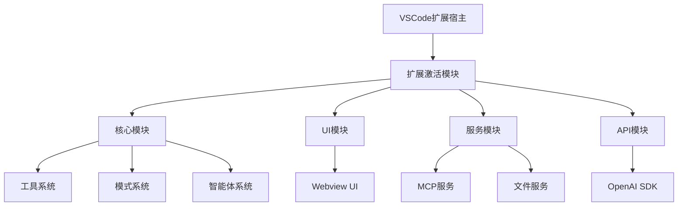
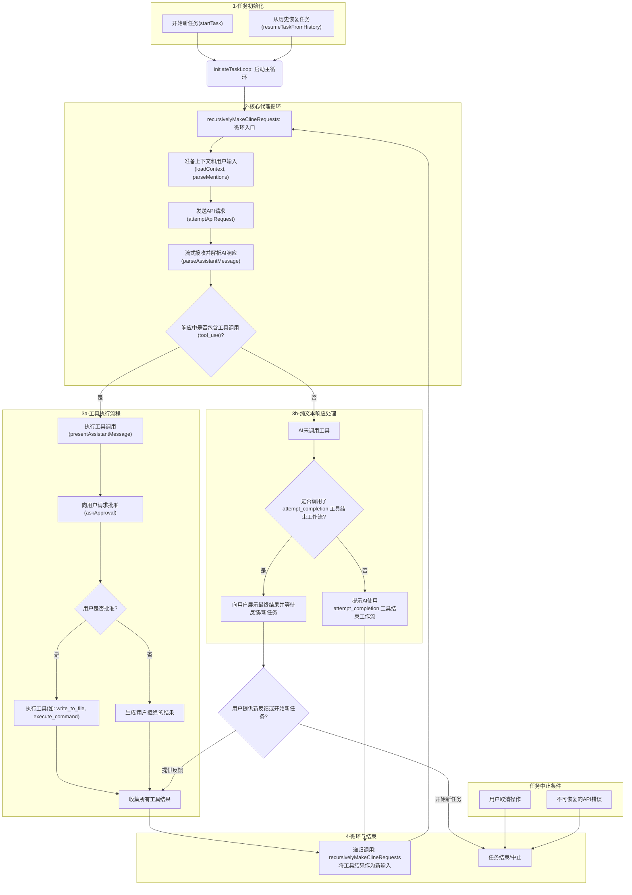
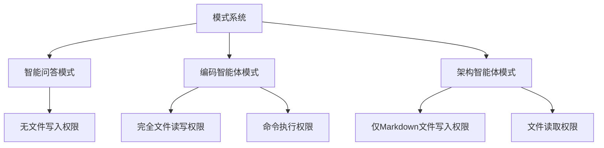
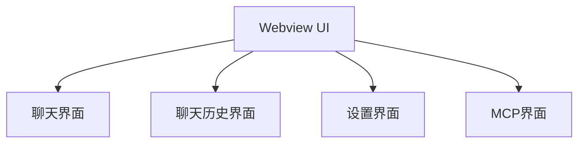

# VS Code 智能体架构文档

## 1. 项目概述

### 插件架构设计（前端、后端、通信协议）

智能体采用的是典型的 VS Code 插件架构：一个运行在 Node.js 环境的**插件后端 (Extension Host)** 和一个运行在 Webview 环境的**前端 UI**。两者分工明确，通过 VSCode 的消息传递 API 进行通信。

*   **后端 (Extension)**:
    *   **入口与激活**: (`src/extension.ts`) 负责注册所有服务，是整个插件的入口。
    *   **核心智能体(`Cline`)**: (`src/core/Cline.ts`) 是整个插件的大脑。管理着与大模型的完整对话流，实现了一个经典的 **“思考-行动”循环 (Agentic Loop)**。它解析模型的响应，识别出工具调用请求（如 `read_file`, `execute_command`），执行这些工具，然后将结果返回给模型，进行下一轮迭代，直到任务完成。
    *   **VSCode API 封装**: (`src/core/EditorUtils.ts`, `src/integrations/`) 封装了大量的 VSCode API，用于与编辑器、终端、文件系统等交互，为智能体提供可执行的“工具”。
    *   **MCP 中心 (`McpHub`)**: (`src/services/mcp/McpHub.ts`) 插件内部的插件化核心。负责管理和连接外部的 MCP 服务器，这些服务器通过标准输入/输出（Stdio）与主插件通信，动态地为智能体提供新的工具和资源。

*   **前端 (Webview)**:
    *   **技术栈**: 基于 React 和 VS Code组件库构建，代码位于 `webview-ui/` 目录。
    *   **UI 组件**: 负责渲染聊天界面、设置面板、历史记录等所有用户可见的元素。
    *   **状态管理**: 接收从后端推送的全量状态 (`postStateToWebview`)，并据此进行界面渲染。

*   **通信协议**:
    *   **前端（Webview） <-> 后端（Extension）**:  
        - 前端通过 `window.vscode.postMessage(message)` 向后端发送消息；  
        - 后端通过 `webview.onDidReceiveMessage(listener)` 监听并接收前端消息；  
        - 后端通过 `webview.postMessage(message)` 向前端发送消息；  
        - 前端通过 `window.addEventListener('message', handler)` 接收后端消息。  
        （两端通过 JSON 格式异步消息进行通信）
    *   **后端 <-> 大模型 API**:  
        - 通过 `axios` 或官方 SDK（如 `openai` 等）以 HTTP 协议与大模型服务进行通信，支持流式响应。
    *   **后端 <-> MCP 服务器**:  
        - 通过 `@modelcontextprotocol/sdk` 协议，采用进程间通信（Stdio）连接外部 MCP 服务器，实现对外部工具和资源的调用。


## 2. 系统架构

智能体采用模块化架构，主要分为以下几个核心部分：



### 2.1 核心模块

核心模块是扩展的中心部分，负责处理用户任务、与AI模型交互、管理会话等功能。

#### 2.1.1 智能体系统(src/core/cline.ts)

`Cline`类是扩展的核心类，负责：

- 管理与AI模型的交互
- 处理用户任务
- 执行工具操作（如文件读写、命令执行等）
- 管理会话历史
- 处理流式响应

用户任务处理流程



#### 2.1.2 模式系统(src/mode/mode.ts)

模式系统定义了不同的工作模式，每种模式有不同的权限和功能：



#### 2.1.3 工具系统

工具系统定义了AI可以使用的各种工具，智能体通过提示词让 AI 知道如何使用以下工具：

- **读取工具组**：`read_file`, `search_files`, `list_files`, `list_code_definition_names`
- **编辑工具组**：`write_to_file`, `apply_diff`, `insert_content`, `search_and_replace`
- **命令工具组**：`execute_command`
- **MCP工具组**：`use_mcp_tool`, `access_mcp_resource`
- **通用工具**：`ask_followup_question`, `attempt_completion`, `switch_mode`, `new_task`

每种模式可以访问不同的工具组，通过模式验证器进行权限控制。

调用工具方式：
``` md
<read_file>
    <path>src/test.txt</path>
</read_file>
```

### 2.2 扩展模块

扩展模块负责VSCode扩展的生命周期管理、命令注册和处理等功能。

#### 2.2.1 插件激活模块（src/extension.ts）

`extension.ts`是插件的入口点，负责：

- 初始化插件
- 注册命令、视图和提供者
- 设置事件监听器
- 创建状态栏项

#### 2.2.2 提供者（provider）

扩展包含多个提供者，负责不同的功能：

- **ClineProvider**（src/webview/clineProvider.ts）：作为连接VSCode后端和Webview UI的桥梁，负责创建和管理`Cline`实例、处理Webview消息以及管理配置和状态。
- **CompletionProvider**(src\extension\providers\completion.ts)：提供代码补全功能。其实现细节如下：
    - **上下文收集**：分析当前文件光标前后的代码以及其他相关的已打开文件。
    - **提示词构建**：根据编程语言和收集的上下文构建适合代码补全的提示。
    - **流式处理**：高效处理模型的流式响应，以实时显示补全结果。
    - **格式化**：根据编程语言规范对返回的代码片段进行格式化。
- **CodeActionProvider**(src/core/CodeActionProvider.ts)：提供代码操作功能（如解释代码、检查代码，优化代码等）。
- **DiffViewProvider**（src\integrations\editor\DiffViewProvider.ts）：提供差异视图功能，用于展示`apply_diff`等工具执行前后产生的代码变更。

### 2.3 服务模块

服务模块提供各种辅助功能，如MCP服务、文件服务等。

#### 2.3.1 MCP服务

MCP（Model Context Protocol）服务让插件可以和外部的工具或服务进行交互，从而大大扩展智能体的能力。例如，AI 可以通过 MCP 访问项目外部的专用 API、数据库、自动化工具等。

- **McpHub**：负责和所有外部 MCP 服务建立连接，并管理这些连接，让智能体可以方便地调用外部的各种工具和资源。
- **McpServerManager**：作为单例管理器，确保同一时间只会有一个 MCP 服务实例在运行，避免资源冲突和重复连接。

#### 2.3.2 文件服务

文件服务模块提供了一套全面的文件系统交互功能，使智能体能够理解和操作工程中的文件。这些服务被封装在 `src/services/` 目录下的多个专用模块中，为上层的工具（如 `list_files`, `search_files`, `list_code_definition_names`）提供了核心实现。


*   **文件与目录列表 (`src/services/glob/list-files.ts`)**
    *   **功能**: 提供了一个名为 `listFiles` 的函数，用于列出指定目录下的文件和子目录。

*   **文件内容正则搜索 (`src/services/ripgrep/index.ts`)**
    *   **功能**: 提供了一个名为 `regexSearchFiles` 的函数，允许在指定目录中进行高效的文件内容正则表达式搜索。

*   **源代码结构解析 (`src/services/tree-sitter/index.ts`)**
    *   **功能**: 提供了 `parseSourceCode` 函数，使用 `Tree-sitter` 进行语法树分析，能够解析源代码文件并提取出关键的定义，如类、函数、接口等。


### 2.4 API模块

API模块负责与大模型的通信：

- **ApiHandler**：处理API请求
- **ApiStream**：处理流式响应
- 支持多种AI提供商：OpenAI、deepseek等

### 2.5 UI模块

UI模块负责用户界面，基于React构建：




