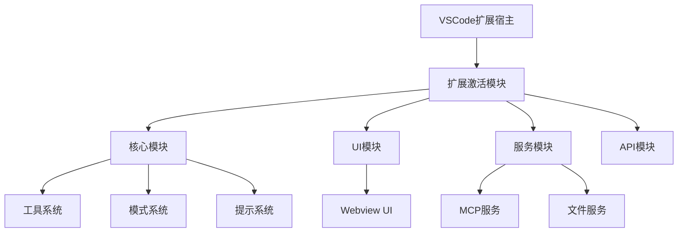
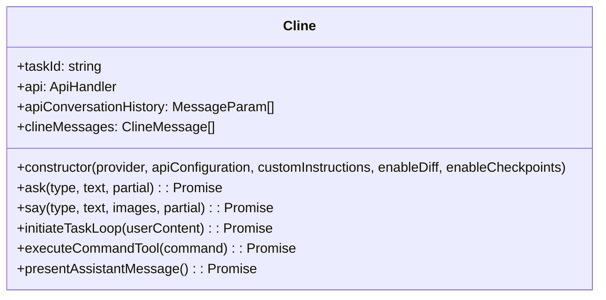
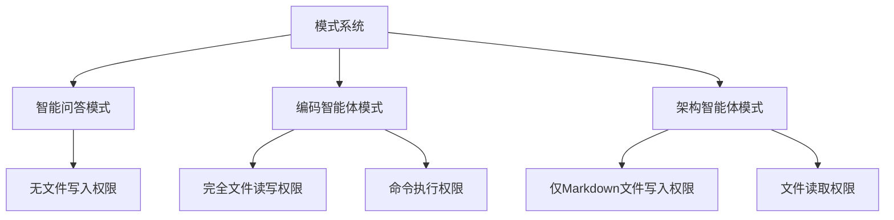
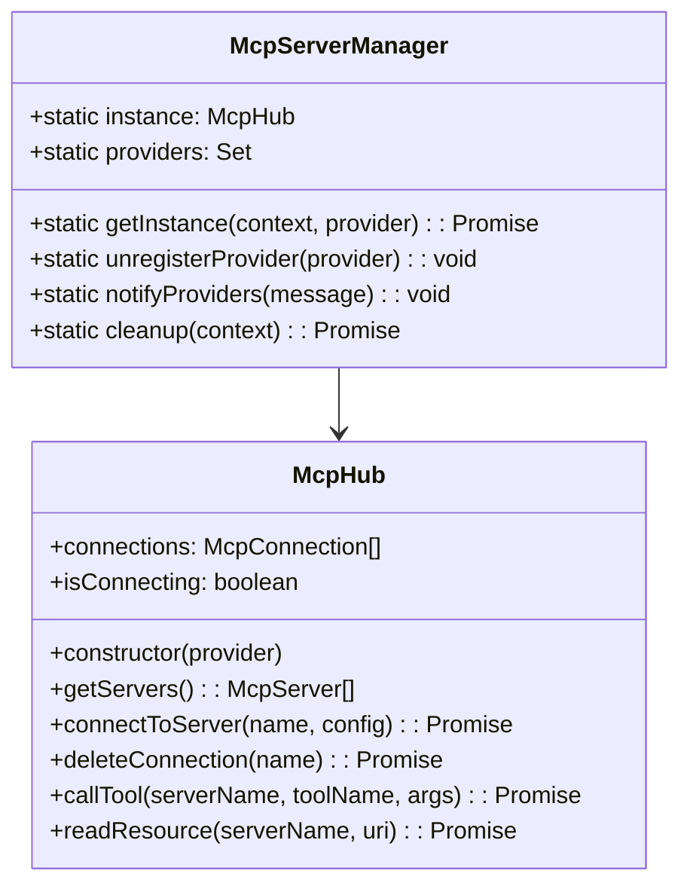
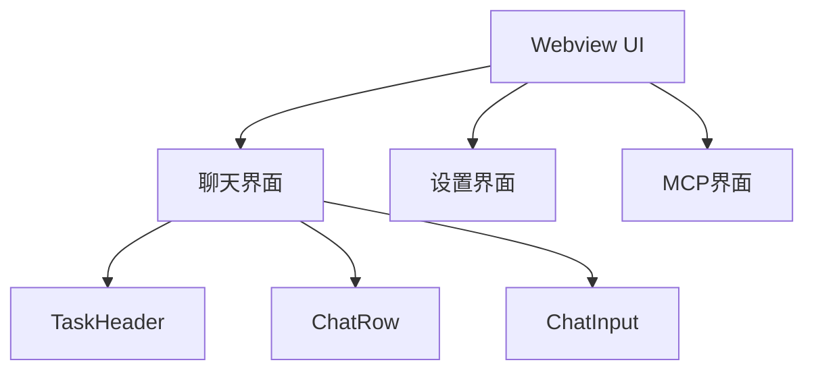
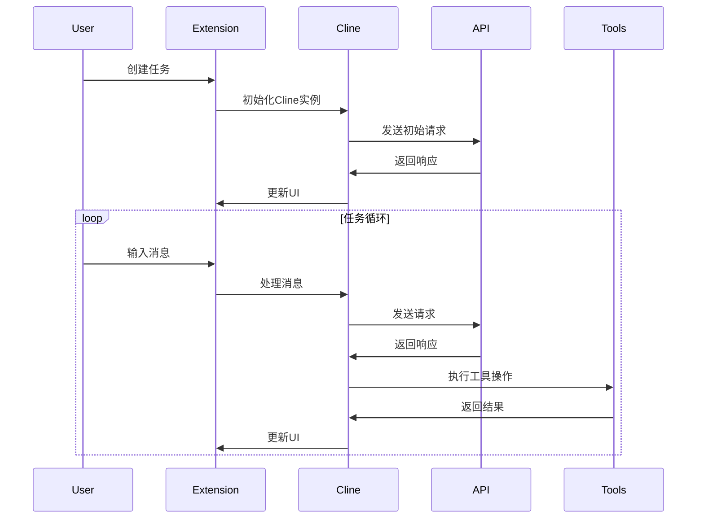
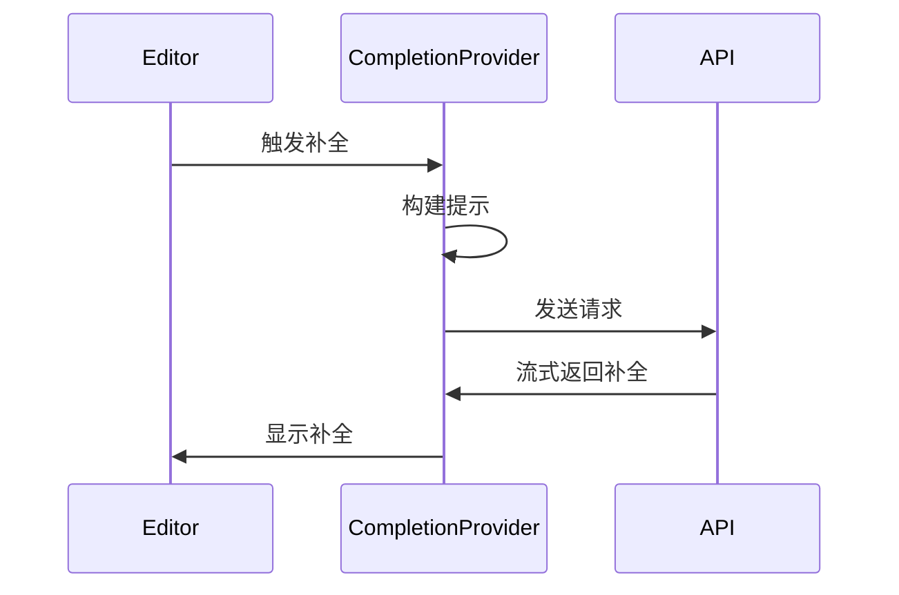

# AIxCoding VSCode扩展架构文档

## 1. 项目概述

AIxCoding是一个基于大模型的智能编码VSCode插件，提供代码补全、代码生成、代码解释等功能。该插件利用多种AI模型（如Anthropic Claude、OpenAI等）提供智能编程辅助功能，并支持通过Model Context Protocol (MCP)与外部服务集成。

## 2. 系统架构

AIxCoding采用模块化架构，主要分为以下几个核心部分：

### 2.1 核心模块

核心模块是扩展的中心部分，负责处理用户任务、与AI模型交互、管理会话等功能。

#### 2.1.1 Cline类

`Cline`类是扩展的核心类，负责：

- 管理与AI模型的交互
- 处理用户任务
- 执行工具操作（如文件读写、命令执行等）
- 管理会话历史
- 处理流式响应

**实现细节:**

- **生命周期**:
    - **创建**: 由 `ClineProvider` 的 `initClineWithTask` 或 `initClineWithHistoryItem` 方法创建。
    - **任务处理**: 通过 `initiateTaskLoop` 方法处理用户任务，这是一个循环，直到任务完成或被中断。
    - **销毁**: 通过 `ClineProvider` 的 `clearTask` 方法清理，以释放资源。
- **工具执行流程**:
    1. **生成请求**: AI模型在其响应中生成一个使用工具的请求。
    2. **解析请求**: `Cline` 通过 `presentAssistantMessage` 方法解析该请求。
    3. **权限验证**: 当前激活的模式验证器检查该模式是否有权限执行所请求的工具。
    4. **执行操作**: 如果验证通过，`Cline` 将执行相应的工具操作。
    5. **返回结果**: 工具的执行结果被格式化并发送回AI模型。
    6. **继续生成**: AI模型根据工具结果继续生成其最终响应。

#### 2.1.2 模式系统

模式系统定义了不同的工作模式，每种模式有不同的权限和功能：

- **智能问答模式**：专注于回答问题和提供信息
- **编码智能体模式**：可以读写文件、执行命令等
- **架构智能体模式**：专注于规划和设计，有限的文件写入权限（仅Markdown文件）

#### 2.1.3 工具系统

工具系统定义了AI可以使用的各种工具，按功能分组：

- **读取工具组**：`read_file`, `search_files`, `list_files`, `list_code_definition_names`
- **编辑工具组**：`write_to_file`, `apply_diff`, `insert_content`, `search_and_replace`
- **命令工具组**：`execute_command`
- **MCP工具组**：`use_mcp_tool`, `access_mcp_resource`
- **通用工具**：`ask_followup_question`, `attempt_completion`, `switch_mode`, `new_task`

每种模式可以访问不同的工具组，通过模式验证器进行权限控制。

### 2.2 扩展模块

扩展模块负责VSCode扩展的生命周期管理、命令注册和处理等功能。

#### 2.2.1 扩展激活

`extension.ts`是扩展的入口点，负责：

- 初始化扩展
- 注册命令、视图和提供者
- 设置事件监听器
- 创建状态栏项

#### 2.2.2 提供者

扩展包含多个提供者，负责不同的功能：

- **ClineProvider**：作为连接VSCode后端和Webview UI的桥梁，负责创建和管理`Cline`实例、处理Webview消息以及管理配置和状态。
- **CompletionProvider**：提供代码补全功能。其实现细节如下：
    - **上下文收集**：分析当前文件光标前后的代码以及其他相关的已打开文件。
    - **提示构建**：根据编程语言和收集的上下文构建适合代码补全的提示。
    - **流式处理**：高效处理模型的流式响应，以实时显示补全结果。
    - **格式化**：根据编程语言规范对返回的代码片段进行格式化。
- **CodeActionProvider**：提供代码操作功能（如快速修复、重构建议）。
- **DiffViewProvider**：提供差异视图功能，用于展示`apply_diff`等工具执行前后产生的代码变更。

### 2.3 服务模块

服务模块提供各种辅助功能，如MCP服务、文件服务等。

#### 2.3.1 MCP服务

MCP（Model Context Protocol）服务允许扩展与外部服务通信，扩展AI的能力：

- **McpHub**：管理MCP连接和服务
- **McpServerManager**：单例管理器，确保只有一个MCP服务实例

**集成细节:**

- **服务发现**: 扩展通过读取配置文件来发现可用的MCP服务器。
- **连接管理**: `McpHub` 负责根据配置建立和维护与MCP服务器的连接。
- **工具调用**: `McpHub` 的 `callTool` 方法负责将工具调用请求路由到指定的MCP服务器。
- **资源访问**: `McpHub` 的 `readResource` 方法用于访问MCP服务器提供的资源。
- **错误处理**: 包含连接错误、请求超时等多种错误处理机制，以确保系统的稳定性。

#### 2.3.2 文件服务

文件服务不是一个单一的类或模块，而是一组功能的总称，其职责分散在多个文件中，主要负责文件的读取、写入、搜索和列表等操作。

- **核心文件操作**:
    - **协调与执行**: [`src/core/webview/ClineProvider.ts`](src/core/webview/ClineProvider.ts) 是文件操作的核心协调者。它直接导入Node.js的`fs`模块并调用 `vscode.workspace.fs` API来执行底层的读写操作，响应来自核心逻辑的请求。
    - **工具调用**: [`src/core/Cline.ts`](src/core/Cline.ts) 负责解析AI模型的工具调用请求（如`read_file`, `write_to_file`），并触发`ClineProvider`执行相应的文件操作。
- **文件列表 (`list_files`)**:
    - **实现**: 由 [`src/services/glob/list-files.ts`](src/services/glob/list-files.ts) 专门负责。它使用`globby`库来高效地、递归地列出文件和目录，并包含了防止在敏感目录（如根目录、用户主目录）中进行操作的安全检查。
- **文件交互跟踪**:
    - **实现**: [`src/extension/file-interaction.ts`](src/extension/file-interaction.ts) 中的`FileInteractionCache`负责跟踪和缓存用户与文件的交互行为（如访问次数、编辑时长、按键次数等），为将来的智能上下文功能提供数据支持。
- **其他相关功能**:
    - **文件差异比较**: 用于实现`apply_diff`等相关工具。
    - **代码定义解析**: 用于实现`list_code_definition_names`工具。

### 2.4 API模块

API模块负责与AI模型的通信：

- **ApiHandler**：处理API请求
- **ApiStream**：处理流式响应
- 支持多种AI提供商：Anthropic、OpenAI、OpenRouter等

### 2.5 UI模块

UI模块负责用户界面，基于React构建：

- **Webview UI**：React应用，提供用户界面
- **组件**：如ChatView、TaskHeader、ChatRow等
- **状态管理**：使用Context API管理状态

## 3. 数据流

### 3.1 用户任务处理流程

### 3.2 代码补全流程

## 4. 扩展点

AIxCoding提供多个扩展点，允许进一步扩展功能：

### 4.1 MCP服务器

通过实现MCP服务器，可以扩展AI的能力，如：

- 连接到外部API
- 提供特定领域的工具
- 访问外部资源

### 4.2 自定义模式

可以创建自定义模式，定义特定的角色和权限，适用于不同的使用场景。

## 5. 配置系统

AIxCoding提供丰富的配置选项，包括：

- API配置（提供商、模型、密钥等）
- 工具配置（允许的命令、文件权限等）
- UI配置（主题、布局等）
- MCP配置（服务器、工具等）

## 6. 总结

AIxCoding是一个功能丰富的VSCode扩展，通过模块化架构和灵活的配置系统，提供强大的AI编程辅助功能。核心的Cline类、模式系统和工具系统共同工作，为用户提供智能的编程体验。通过MCP协议，扩展可以与外部服务集成，进一步扩展其功能。
